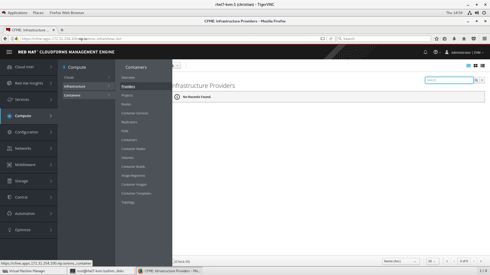
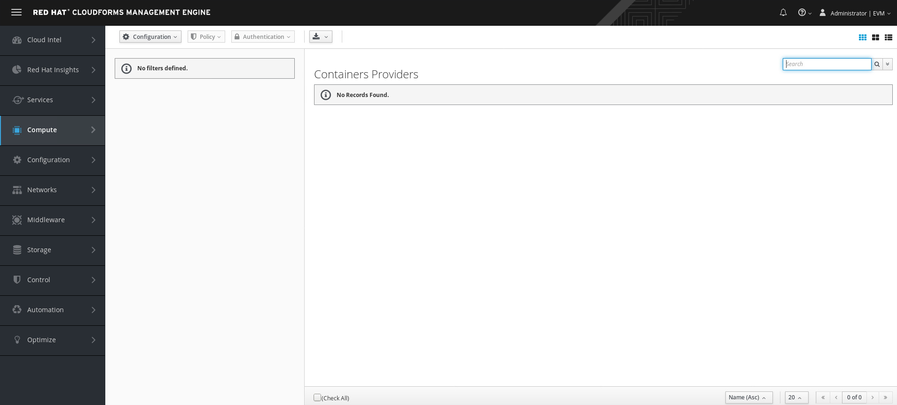
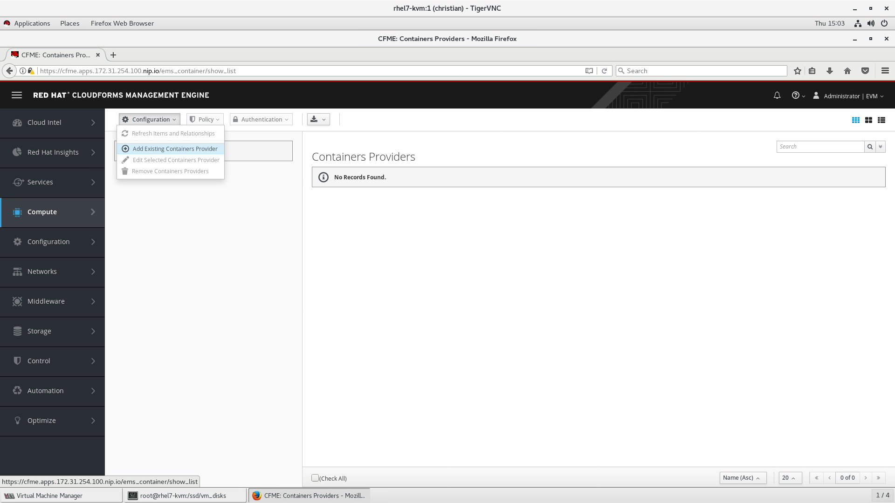
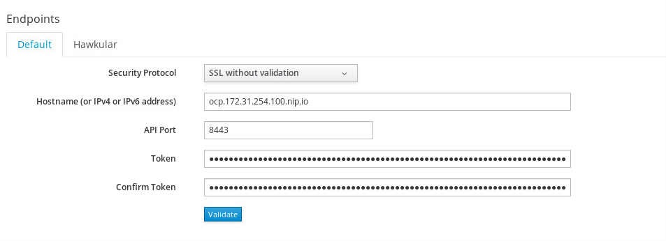
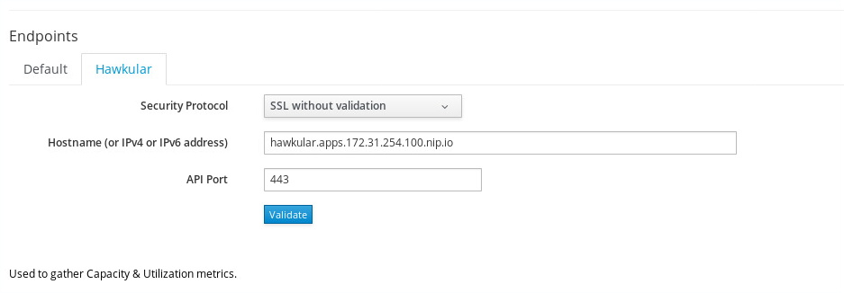
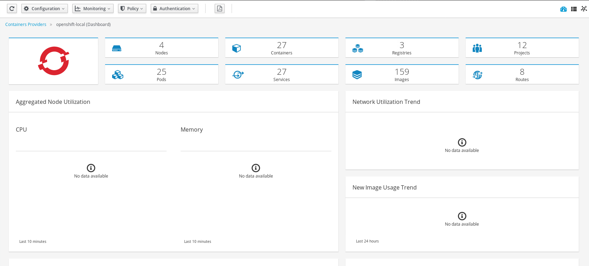

# Deploying CloudForms

In this lab you will learn how to deploy CloudForms on an OpenShift environment. 

CloudForms is a multicloud management platform that helps operations set up policy controlled, self-service environments for cloud users. Detect and respond to environment changes by tracking activities, capturing events, and sensing configuration changes.

Along with monitoring and chargeback capabilities, CloudForms also integrates with Ansible; featuring 10,000+ Ansible Playbooks and 1,000+ integration modules—to help you automate your IT environment.

CloudForms is used as the Admin Console for OpenShift.

Prereqs:

* Running OpenShift Cluster
* Persistant Storage
  * You need 5Gi, 15Gi, and an additional 5Gi available with `RWO` access
  * OR; have CNS installed and configured

## Step 1 - Preparing Deplyment

First, you need to create a project for you CloudForms appliance.

```
$ oc new-project cloudforms
```

Next, set the `cfme-anyuid` service account to have `anyuid` access. Also add your `default` service account to the privileged security context. This is so they can run privileged pods.

```
$ oc adm policy add-scc-to-user anyuid system:serviceaccount:cloudforms:cfme-anyuid
$ oc adm policy add-scc-to-user privileged system:serviceaccount:cloudforms:default
```

Verify that the `cfme-anyuid` service account is now included in the anyuid SCC, and that it can run priviliged pods

```
$ oc describe scc anyuid | grep Users
Users:					system:serviceaccount:cloudforms:cfme-anyuid

$ oc describe scc privileged | egrep 'Users|cloudforms' | awk -F',' '{print $NF}'
system:serviceaccount:cloudforms:default
```
Lastely, increase the maximum number of imported images on ImageStream. 

By default, OpenShift Container Platform can import five tags per image stream, but the CloudForms repositories contain more than five images for deployments. You can modify this setting on the master node at `/etc/origin/master/master-config.yaml` so OpenShift can import additional images.

```
# vi /etc/origin/master/master-config.yaml
```

And add the following lines at the end of the file

```
imagePolicyConfig:
  maxImagesBulkImportedPerRepository: 100
```

Restart the master service

```
# systemctl restart atomic-openshift-master-api.service
```

## Step 2 - Deploying CloudForms

Switch over to the `cloudforms` project you created

```
$ oc project cloudforms
Now using project "cloudforms" on server "https://master.example.com:8443".
```

Create the Red Hat CloudForms template and verify that it was loaded.
```
$ oc create -f /usr/share/openshift/examples/cfme-templates/cfme-template.yaml
template "cloudforms" created

$ oc get templates
NAME         DESCRIPTION                                    PARAMETERS     OBJECTS
cloudforms   CloudForms appliance with persistent storage   32 (1 blank)   12
```

Deploy the template, changing the value of the application name to suit your environment

```
oc new-app --template=cloudforms -p APPLICATION_DOMAIN=cfme.apps.example.com
```

The installation will take some time as it has to set up and configure storage, databases, and the appliance itself.

## Step 3 - Verification

Verify that your pods are running

```
$ oc get pods
NAME                 READY     STATUS    RESTARTS   AGE
cloudforms-0         1/1       Running   0          7m
memcached-1-ck8hg    1/1       Running   0          7m
postgresql-1-t778f   1/1       Running   0          7m
```

If you're having issues; one of the things you can check to see is if the `pvc` is bound. It should look like this

```
$ oc get pvc
NAME                             STATUS    VOLUME                                     CAPACITY   ACCESSMODES   STORAGECLASS        AGE
cloudforms-postgresql            Bound     pvc-a20c7b1a-dc61-11e7-a967-025f1bb02b98   15Gi       RWO           glusterfs-storage   7m
cloudforms-region                Bound     pvc-a20e01d7-dc61-11e7-a967-025f1bb02b98   5Gi        RWO           glusterfs-storage   7m
cloudforms-server-cloudforms-0   Bound     pvc-a21391e8-dc61-11e7-a967-025f1bb02b98   5Gi        RWO           glusterfs-storage   7m
```

After you have successfully validated your CloudForms deployment, disable automatic image change triggers to prevent unintended upgrades.

By default, on initial deployments the automatic image change trigger is enabled. This could potentially start an unintended upgrade on a deployment if a newer image is found in the ImageStream.

Disable the automatic image change triggers for CloudForms deployment configurations (DCs) on each project with the following commands
```
$ oc set triggers dc --manual -l app=cloudforms
deploymentconfig "memcached" updated
deploymentconfig "postgresql" updated

$ oc set triggers dc --from-config --auto -l app=cloudforms
deploymentconfig "memcached" updated
deploymentconfig "postgresql" updated
```

Next, Change your password to ensure more private and secure access to Red Hat CloudForms.

* Navigate to the URL for the login screen. (Get this by running `oc get routes -n cloudforms`)
* Click Update Password beneath the Username and Password text fields.
* Enter your current Username and Password in the text fields. (current/default login below)
  * username: admin
  * password: smartvm
* Input a new password in the New Password field.
* Repeat your new password in the Verify Password field.
* Click Login.

If successful, you'll see the overview page like this.


## Step 4

Next, you'll need to connect OpenShift to CloudForms. Hover over `Compute` ~> `Containers` ~> `Providers`. It should look like this



Go ahead and click on `Providers`. The `Containers Providers` overview page should look like this.



Next click on `Configuration` ~> `Add Existing Containers Provider`. It should look like this



Now on the command line, create a service account, and assign it `cluster-admin` privliges
```
$ oc create serviceaccount cfsa -n cloudforms
serviceaccount "cfsa" created

$ oc adm policy add-cluster-role-to-user cluster-admin system:serviceaccount:cloudforms:cfsa
cluster role "cluster-admin" added: "system:serviceaccount:cloudforms:cfsa"
```

Now, get the sa token; this is what is used to interact with OpenShift. (Put it in your copy buffer)
```
oc sa get-token cfsa
```

Now back in the UI, fill in the `Add New Containers Provider` with your information. It should look something like this.


In the next section there will be two tabs. `Default` is your openshift API information. And `Hawkular` is your metrics API endpoint.

Under `Default` enter your Master API information. Make sure you select `SSL Without Validation` as we are using a self signed SSL cert. Under `Token`, enter the token you got from the `oc sa get-token cfsa` command. Once you have the information, Click `Validate` ...it should look like this.



Under the `Hawkular` tab, enter the hakwular route information from `oc get routes -n openshift-infra`. Remember to choose `SSL Without Validation`.



Once they are both validated, click on `Add` on the bottom right hand side. You should see a page like this.


Once you click on the OpenShift logo, it should take you to the overview page (it will take some time to gather metrics)



## Conclusion

In this lab you learned how to deploy the CloudForms appliance on OpenShift and how to connect the two together. 
